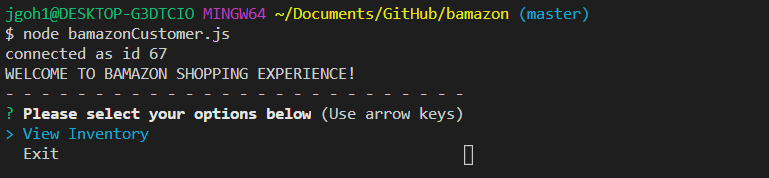

# BAMAZON
A storefront CLI app using MySQL to take orders from customers and deplete stock from the store's inventory. It will generate pricing information and keep track of stocks for inventory management.

## Overview
This app uses the command line in Node.js CLI to generate a response from the functions in the application. To retrieve the data that will power this app, users will require:
- To install node.js 
- Intall npms: inquirer, MySql, colors, console table 
- Customer need a MySql password in bamazonCustomer.js (for this to work). 

## Instructions
The user will be able to search for upcoming concerts by artist or band via Bands In Town api. This will provide concerts venue, location and date.
