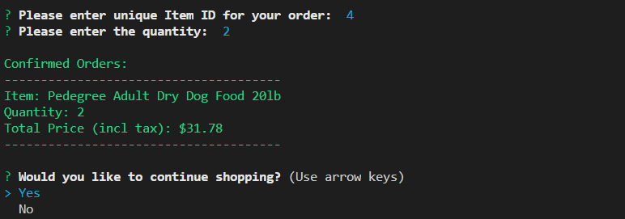
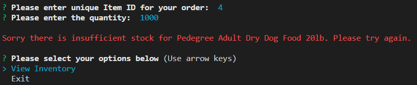
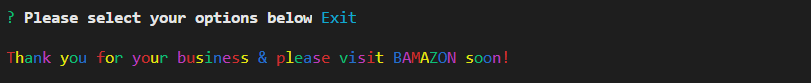

# BAMAZON
A storefront CLI app using MySQL to take orders from customers and deplete stock from the store's inventory. It will generate pricing information and keep track of stocks for inventory management.

## Overview
This app uses the command line in Node.js CLI to generate a response from the functions in the application. To retrieve the data that will power this app, users will require:
- To install node.js 
- Install npms: inquirer, MySql, colors, console table 
- Customer need a MySql password in bamazonCustomer.js (for this particular exercise). 

## Instructions
The customer will enter the app via the node command line which will prompt for a on option to see what is available.  

This will provide the customer with a snapshot of what is available for sale. The table incude a unique item ID, product, unit price and available stocks. Customer will then be prompted to either place an order or if nothing is interesting leave the app.  

In placing the order, the customer will be provided with the table again and require to select the item using the ID number. The quantity will be prompted next. Once everything is checked out the customer will receive the order confirmation with the product purchased, quantity and a calculated value including tax. 

If the item number is incorrectly filled, an alert message will prompt the customer to either re-order or exit the app.  

Should the customer's order exceed the available stock, an alert message will also prompt the customer to revist the inventory page to revise quantity or exit the app.  

Upon exiting the app at any time, the customer will be alerted with a message.  

Note: this work has been added to my portfolio page in my bio.
[MyPortolio](https://jgohbb.github.io/Portfolio-JGoh/portfolio.html)

